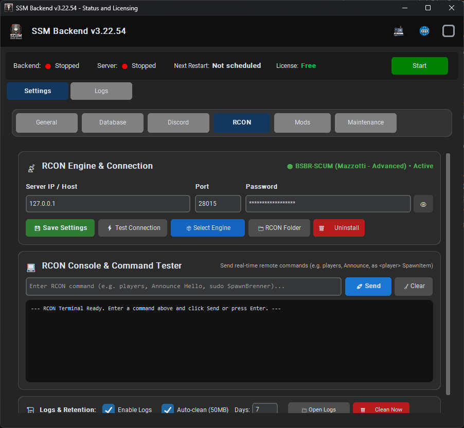
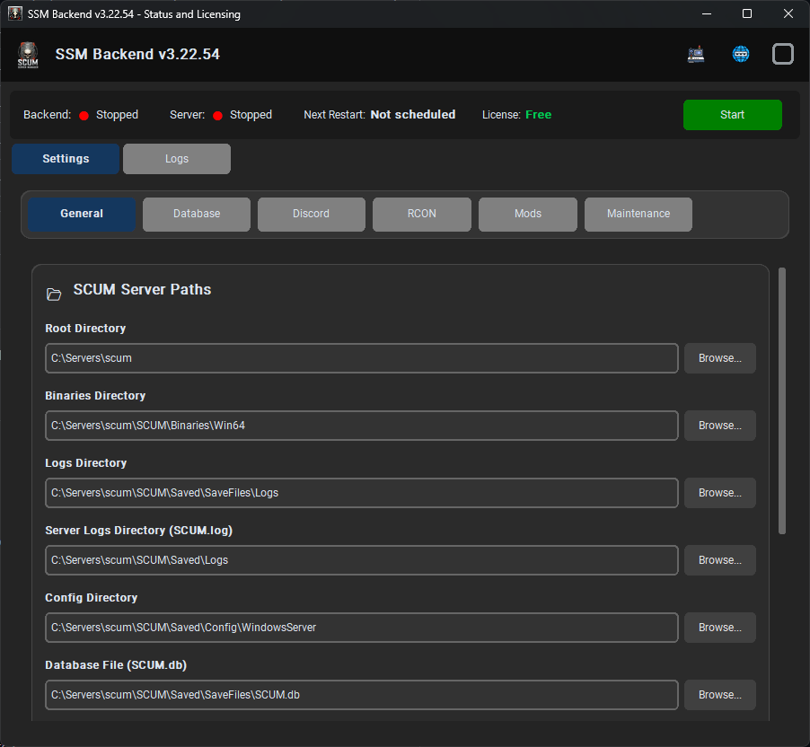
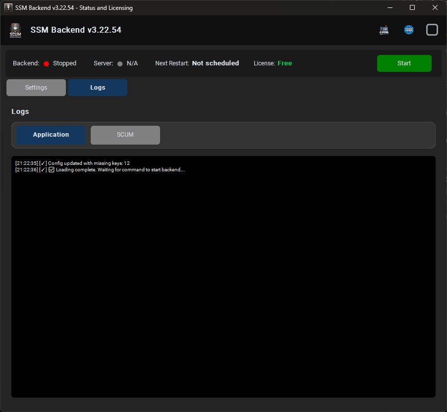
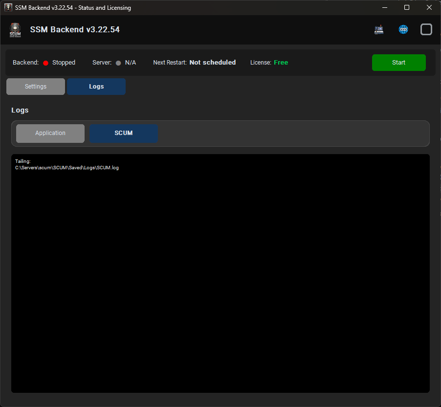

# 🎮 SCUM Server Manager (SSM) - Backend 3.0

<div align="center">


**Plataforma modular e avançada para automação, monitoramento e gerenciamento de servidores dedicados de SCUM.**

</div>

---

## 📸 Interface Desktop (Painel SSM)

O SSM Backend integra uma interface desktop moderna (`Panel SSM.exe` construída com CustomTkinter) juntamente com o servidor de API Flask em thread interna.

| ⚡ RCON Engine & Console Interativo | 📁 Configurações e Diretórios |
| :---: | :---: |
|  |  |

| 📊 Logs da Aplicação (Backend) | 📜 Monitoramento de Logs do SCUM |
| :---: | :---: |
|  |  |

---

## 🚀 Principais Funcionalidades

### 🎮 1. Gerenciamento e Injeção RCON Multi-Motor
* **Suporte a Múltiplos Motores RCON**:
  * **`BSBR-SCUM (Mazzotti - Advanced)`**: Suporte completo a comandos estendidos (`players`, `Announce`, `SpawnItem`, `sudo SpawnBrenner`, `SetFame`, `Teleport`, etc.).
  * **`SCUM-RCON (Native)`**: Motor alternativo rápido baseado em DLL UE4SS.
* **Console Interativo em Tempo Real (RCON Tester)**:
  * Terminal integrado com atalho `Enter` para testes diretos de entrega e comandos administrativos.
  * Validação automática de sintaxe (bloqueio do prefixo `#` de chat in-game com orientação amigável).
  * Medição de latência e tempo de resposta em milissegundos (`ms`).
* **Sistema de Logs Estruturados e Retenção (`RconLogger`)**:
  * Mascaramento automático de senhas e dados sensíveis.
  * Rotação diária em `data/logs/rcon/` com auto-limpeza por cota (50MB) e retenção por dias configurável.

---

### 📦 2. Gerenciador de Mods .PAK & Armazenamento Seguro
* **Convenção Oficial do Unreal Engine (`~mods`)**:
  * Instalação automática na pasta padrão do jogo: `SCUM/Content/Paks/~mods/`.
  * O caractere `~` garante prioridade de carregamento sobre os `.pak` originais do jogo.
* **Safe Storage Automático (`data/mods/paks/`)**:
  * Ao importar um mod pelo botão `+ Install .pak Mod`, o SSM cria uma cópia de backup segura no repositório local e instala no servidor.
  * Botão **`💾 Safe Storage`** na interface para gerenciamento visual da biblioteca de mods.
* **Ativação / Desativação com 1 Clique**:
  * Alterne mods entre `.pak` (ativo) e `.pak.disabled` (ignorado pela Unreal Engine) sem necessidade de deletar os arquivos.

---

### 🛒 3. Loja e Entregas In-Game Automatizadas (Shop Delivery)
* **Processamento de Pedidos e Kits**:
  * Fila de entregas thread-safe com priorização via `RconQueueManager`.
  * Detecção de jogadores online e execução de comandos `spawnitem` e `spawnvehicle` no local exato do personagem (`Location "<steamid>"`).
  * Suporte a kits com múltiplos sub-itens e veículos.

---

### 📊 4. Processamento de Logs e Eventos em Tempo Real
* **Monitores Especializados**:
  * **Kills & Pvp Feed**: Distância, arma utilizada, headshots e ranking.
  * **Chat in-game**: Monitoramento de canais Global, Local e Squad.
  * **Bunkers & Lockpicking**: Estatísticas de arrombamento de travas e invasões.
  * **Destruição de Veículos & Bases**: Registro de perda de patrimônio.
  * **Ranking de Pescadores**: Integração com `SCUM.db` e webhooks no Discord.

---

### 🛡️ 5. Controle do Servidor & Clean Shutdown
* **Controle de Processos e Serviços**:
  * Integração com **NSSM** (*Non-Sucking Service Manager*) e gerenciamento direto de processos `SCUM.exe`.
  * **Graceful Shutdown**: Encerramento limpo com encerramento ordenado de threads, liberação de sockets e salvamento de estado do SQLite WAL.
* **Rotinas Agendadas (Schedulers)**:
  * Agendamento de reinicializações periódicas com avisos no chat in-game.
  * Sincronização e transições de clima/tempo no servidor.

---

## 📁 Estrutura de Diretórios

```
Backend/
├── app/                        # Rotas e extensões da API Flask
│   └── routes/                 # Endpoints REST (players, shop, rcon, etc.)
├── core/                       # Núcleo de serviços e regras de negócio
│   ├── communication/          # Heartbeat, licenciamento e comandos remotos
│   ├── logs/                   # Processadores de logs (chat, kills, bunkers, etc.)
│   ├── rcon_queue_manager.py   # Fila thread-safe de comandos RCON
│   ├── scheduler/              # Agendadores de restart, rotinas e clima
│   ├── server_control/         # Gerenciador do processo do servidor SCUM
│   ├── shop/                   # Serviços de loja, entregas e carteira
│   ├── squads/                 # Sincronização de esquadrões e punições
│   └── survival/               # Estatísticas de sobrevivência e rankings
├── data/                       # Arquivos de dados e configurações locais
│   ├── mods/                   # Motores RCON (bsbr_scum, scum_rcon, ue4ss) e paks
│   ├── notifications/          # Templates de mensagens in-game
│   └── templates/              # Banco de templates de itens e veículos
├── docs/                       # Documentações técnicas e imagens do painel
│   └── images/                 # Capturas de tela da interface desktop
├── gui/                        # Interface gráfica desktop CustomTkinter
│   └── main_window.py          # Janela principal do Panel SSM
├── tools/                      # Utilitários de build, ícones e cópia de assets
├── utils/                      # Módulos auxiliares
│   ├── bsbr_client.py          # Cliente TCP do motor BSBR-SCUM
│   ├── pak_mod_manager.py      # Gerenciador de mods .PAK e Safe Storage
│   ├── rcon_client.py          # Cliente de conexão RCON
│   ├── rcon_logger.py          # Sistema de logs com retenção e mascaramento
│   └── rcon_mod_manager.py     # Instalador e alternador de motores RCON
├── build.py                    # Script automatizado de compilação PyInstaller
├── main.py                     # Ponto de entrada do backend Flask
├── requirements.txt            # Dependências Python
└── ssm_backend.spec            # Especificação de empacotamento PyInstaller
```

---

## ⚙️ Instalação e Execução

### 1. Pré-requisitos
* **Python 3.11+** instalado no Windows.
* Servidor dedicado do **SCUM** instalado.

### 2. Instalação das Dependências
```powershell
pip install -r requirements.txt
```

### 3. Executando em Modo Desenvolvimento
```powershell
# Iniciar o painel com interface desktop e backend Flask integrado:
python gui/main_window.py

# Ou iniciar apenas o backend Flask:
python main.py
```

---

## 🔨 Compilando o Executável (`build.py`)

O projeto inclui um script automatizado que atualiza a versão, compila via **PyInstaller**, aplica ícones e copia todos os dados necessários para distribuição na pasta `dist/`:

```powershell
python build.py
```

O executável final unificado será gerado em:
`dist/Panel SSM.exe`

---

## 🔌 Principais Endpoints da API REST

| Método | Endpoint | Descrição |
| :--- | :--- | :--- |
| `GET` | `/api/health` | Verificação de integridade do backend. |
| `GET` | `/api/server/status` | Status do servidor SCUM (Online/Offline, PID, CPU/RAM). |
| `POST` | `/api/server/start` | Inicia o servidor SCUM. |
| `POST` | `/api/server/stop` | Realiza o encerramento gracioso do servidor. |
| `POST` | `/api/server/restart` | Reinicia o servidor com aviso prévio. |
| `GET` | `/api/players/online` | Lista de jogadores conectados com SteamID64 e ping. |
| `POST` | `/api/shop/delivery` | Enfileira a entrega de itens da loja via RCON. |
| `GET` | `/api/rcon/status` | Status da conexão RCON e motor ativo. |

---

## 📄 Licença

Este projeto está sob a licença **PolyForm Noncommercial License 1.0.0**. 

* ✅ **Uso Livre e Gratuito**: Permitido para todos os administradores, comunidades e desenvolvedores para uso pessoal, pesquisa e servidores de jogo.
* 🚫 **Proibição Comercial Estrita**: É expressamente proibida qualquer venda, revenda, cobrança de taxas de instalação ou monetização do software e de suas versões modificadas por terceiros.

Consulte o arquivo [LICENSE](LICENSE) para ler os termos jurídicos na íntegra.

---

<div align="center">
<b>Desenvolvido com dedicação para a comunidade de administradores e jogadores de SCUM.</b>
</div>

