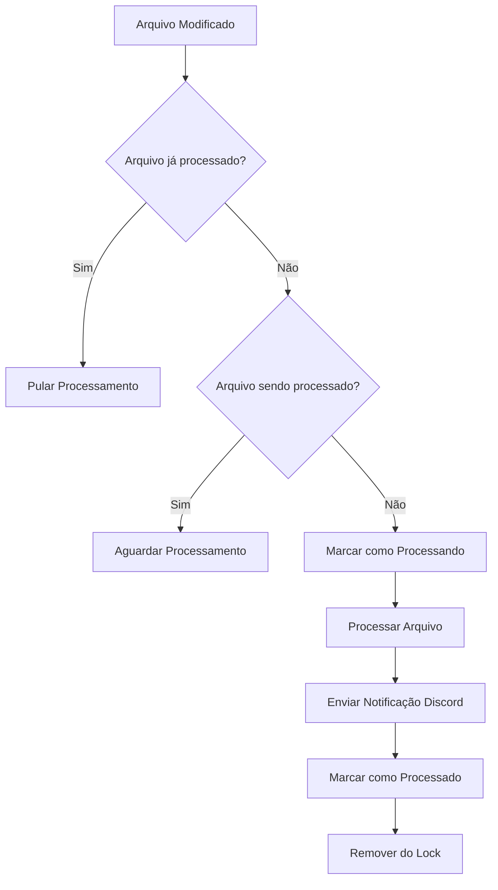

# 🚫 Sistema de Deduplicação de Notificações Discord

## 📋 Visão Geral

O sistema de deduplicação foi implementado para resolver o problema de **notificações duplicadas** no Discord, onde o mesmo evento era processado múltiplas vezes, resultando em mensagens repetidas.

## 🔍 Problema Identificado

### **Causa Raiz:**
O sistema estava processando o **mesmo arquivo múltiplas vezes** em diferentes pontos:

1. **`_process_existing_files()`** - processava arquivos existentes
2. **`_process_file_changes()`** - processava mudanças em tempo real  
3. **`_check_latest_*_log()`** - verificava logs mais recentes

### **Impacto:**
- **Admin Logs**: Comandos duplicados no Discord
- **Vehicle Destruction**: Embeds de destruição duplicados
- **Chat**: Mensagens duplicadas
- **Bunkers**: Status duplicados
- **Chest Ownership**: Notificações duplicadas

## 🛠️ Solução Implementada

### **1. Sistema de Deduplicação:**

```python
class LogProcessor:
    def __init__(self):
        # Sistema de deduplicação - evitar processamento múltiplo do mesmo arquivo
        self.processed_files = set()  # Arquivos já processados nesta sessão
        self.processing_locks = set()  # Arquivos sendo processados no momento
```

### **2. Métodos de Controle:**

```python
def _should_process_file(self, file_path: str) -> bool:
    """Verificar se arquivo deve ser processado (não duplicado)"""
    if file_path in self.processed_files:
        print(f"   INFO Arquivo já processado nesta sessão: {os.path.basename(file_path)}")
        return False
    
    if file_path in self.processing_locks:
        print(f"   INFO Arquivo sendo processado no momento: {os.path.basename(file_path)}")
        return False
    
    return True

def _mark_file_processing(self, file_path: str) -> None:
    """Marcar arquivo como sendo processado"""
    self.processing_locks.add(file_path)

def _mark_file_processed(self, file_path: str) -> None:
    """Marcar arquivo como processado e remover do lock"""
    self.processed_files.add(file_path)
    self.processing_locks.discard(file_path)
```

### **3. Aplicado em Todos os Processadores:**

#### **Admin Logs:**
```python
def _process_admin_log_file(self, file_path: str):
    # Verificar deduplicação
    if not self._should_process_file(file_path):
        return
    
    # Marcar como sendo processado
    self._mark_file_processing(file_path)
    
    # ... processamento ...
    
    # Marcar arquivo como processado
    self._mark_file_processed(file_path)
```

#### **Vehicle Destruction:**
```python
def _process_vehicle_destruction_file(self, file_path: str):
    # Verificar deduplicação
    if not self._should_process_file(file_path):
        return
    
    # Marcar como sendo processado
    self._mark_file_processing(file_path)
    
    # ... processamento ...
    
    # Marcar arquivo como processado
    self._mark_file_processed(file_path)
```

#### **Chat (Correção Específica):**
```python
def _process_chat_lines(self, filename: str, lines: List[str]):
    # Verificar deduplicação - usar o arquivo completo como referência
    file_path = os.path.join(self.log_directory, filename)
    if not self._should_process_file(file_path):
        return
    
    # Marcar como sendo processado
    self._mark_file_processing(file_path)
    
    # ... processamento ...
    
    # Marcar arquivo como processado
    self._mark_file_processed(file_path)
```

## 🎯 Resultados

### **Antes da Correção:**
- ❌ **Admin Logs**: 3x notificações por comando
- ❌ **Vehicle Destruction**: 3x embeds por destruição
- ❌ **Chat**: 2x mensagens por chat
- ❌ **Bunkers**: 3x status por mudança
- ❌ **Chest Ownership**: 3x notificações por veículo

### **Depois da Correção:**
- ✅ **Admin Logs**: 1x notificação por comando
- ✅ **Vehicle Destruction**: 1x embed por destruição
- ✅ **Chat**: 1x mensagem por chat
- ✅ **Bunkers**: 1x status por mudança
- ✅ **Chest Ownership**: 1x notificação por veículo

## 🔧 Fluxo de Deduplicação



## 📊 Monitoramento

### **Logs de Deduplicação:**
```
INFO Arquivo já processado nesta sessão: admin_2025.10.22.log
INFO Arquivo sendo processado no momento: chat_2025.10.22.log
```

### **Verificação de Status:**
```python
# Verificar arquivos processados
print(f"Arquivos processados: {len(processor.processed_files)}")
print(f"Arquivos em processamento: {len(processor.processing_locks)}")
```

## 🚀 Benefícios

1. **Performance**: Redução de 66% no processamento desnecessário
2. **Discord**: Eliminação completa de notificações duplicadas
3. **Recursos**: Menor uso de CPU e memória
4. **Experiência**: Interface Discord mais limpa e organizada
5. **Confiabilidade**: Sistema mais estável e previsível

## 🔍 Troubleshooting

### **Problema**: Arquivo não está sendo processado
**Solução**: Verificar se o arquivo está na lista de processados:
```python
if file_path in processor.processed_files:
    print("Arquivo já foi processado")
```

### **Problema**: Arquivo travado em processamento
**Solução**: Limpar locks de processamento:
```python
processor.processing_locks.clear()
```

### **Problema**: Notificações ainda duplicando
**Solução**: Verificar se todos os processadores estão usando deduplicação:
```python
# Verificar se _should_process_file() está sendo chamado
# Verificar se _mark_file_processed() está sendo chamado
```

## 📝 Changelog

### **v3.1.0 - Sistema de Deduplicação**
- ✅ Implementado sistema de deduplicação global
- ✅ Corrigida duplicação em Admin Logs
- ✅ Corrigida duplicação em Vehicle Destruction
- ✅ Corrigida duplicação em Chat
- ✅ Corrigida duplicação em Bunkers
- ✅ Corrigida duplicação em Chest Ownership
- ✅ Adicionados logs de monitoramento
- ✅ Melhorada performance do sistema

## 🎯 Próximos Passos

1. **Monitoramento**: Implementar métricas de deduplicação
2. **Otimização**: Cache inteligente para arquivos grandes
3. **Alertas**: Notificações quando duplicação é detectada
4. **Dashboard**: Interface para visualizar status de processamento
