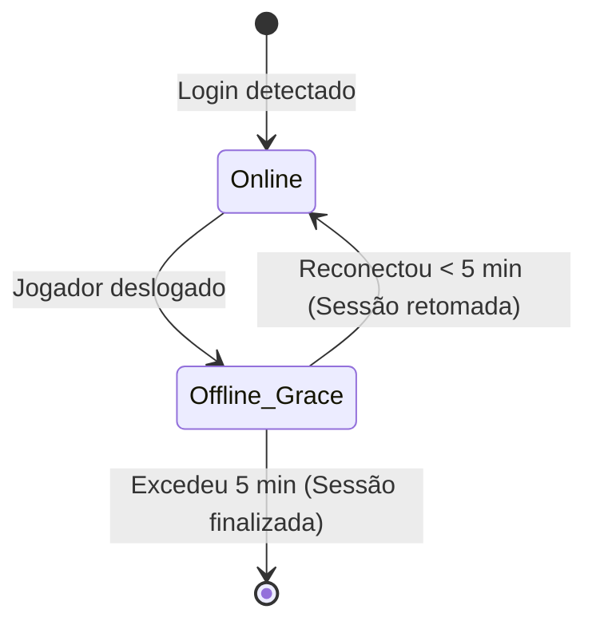

# Playtime Rewards System — Resiliência e Auditoria

Este documento especifica a arquitetura de sessões e o sistema de auditoria implementado no SSM 3.0 para monitoramento e premiação do tempo de jogo online (Playtime) no SCUM.

---

## 🏗️ 1. Arquitetura de Sessão Resiliente

Para proteger o progresso dos jogadores contra quedas repentinas de conexão, travamentos de cliente (crash) ou reinicializações do servidor de jogo, o sistema implementa um **Período de Tolerância (Grace Period)**.

### Funcionamento do Ciclo de Sessões

1. **Login (Início da Sessão)**:
   * Quando o jogador se conecta, o SSM verifica se há uma sessão persistente ativa no arquivo local `data/playtime_sessions.json`.
   * Caso não haja, inicializa a sessão utilizando a data/hora do log (`last_activity`) como baseline inicial de contagem.

2. **Desconexão Temporária (Grace Period)**:
   * Se o jogador deslogar e a sessão estiver ativa, o SSM não a deleta imediatamente. O timestamp de deslog é gravado sob a chave `offline_since` e o progresso da contagem de minutos acumulados na hora atual é congelado.
   * O período padrão de tolerância é definido por `playtime_rewards.grace_period_minutes` no `config.json` (padrão: 5 minutos).

3. **Reconexão dentro da Tolerância**:
   * Se o jogador reconectar dentro do prazo limite, a diferença temporal de ausência é adicionada ao tempo de baseline, congelando com perfeição os minutos conquistados antes da desconexão.
   * A sessão volta a ficar com status ativo e a contagem progride.

4. **Tolerância Excedida**:
   * Se na checagem periódica for detectado que o jogador está offline além do tempo limite de tolerância, a sessão é destruída em definitivo. O progresso parcial acumulado na fração da hora é descartado.

---

## ⏱️ 2. Fuso Horário Unificado (UTC)

Todos os timestamps gerados pelo SCUM ou pelo próprio sistema operacional do SSM são normalizados e parseados em **UTC estrito** utilizando a função nativa `datetime.utcnow()`. Isso mitiga bugs e discrepâncias de horário caso o servidor de hospedagem esteja localizado em fuso horário diferente do fuso local ou daquele dos jogadores.

---

## 📢 3. Sistema de Auditoria no Discord

O painel SSM dispara logs transparentes e de alto contraste em **inglês** para o canal dedicado `⏱️┃playtime-rewards`. 

> [!NOTE]
> Para evitar poluição visual, o canal utiliza formatação em texto puro e de alto contraste (sem Embeds), ideal para logs corporativos e de fácil leitura em dispositivos móveis.

### Eventos e Mensagens Padronizadas (Inglês)

| Evento | Exemplo de Mensagem |
| :--- | :--- |
| **Login** | `APP TerraBot [PLAYTIME] Player Name (SteamID: 123... | Discord: <@123...>) logged in. Balance: 100 points.` |
| **Retorno (Grace Period)** | `APP TerraBot [PLAYTIME] Player Name (SteamID: 123... | Discord: <@123...>) returned (Session resumed). Balance: 100 points.` |
| **Premiação Concedida** | `APP TerraBot [PLAYTIME] Player Name (SteamID: 123... | Discord: <@123...>) completed 1 hour(s) online and earned +100 points. New balance: 200 points.` |
| **Desconexão Temporária** | `APP TerraBot [PLAYTIME] Player Name (SteamID: 123... | Discord: <@123...>) disconnected. Online time in session: 45m. 5min grace period started (Progress of 45m temporarily frozen).` |
| **Exclusão Definitiva** | `APP TerraBot [PLAYTIME] Player Name (SteamID: 123... | Discord: <@123...>) logged out permanently (grace period exceeded). Session terminated (Progress of 45m discarded).` |

---

## 🗄️ 4. Concorrência e Integração com Banco de Dados

* **Prevenção de Locks**: Consultas ao saldo do jogador durante a execução dos ticks periódicos realizam leituras no banco diretamente na transação ativa (`ssm_tx`), garantindo que não ocorra contenção de travamento de escrita (`database is locked`).
* **Filtro de Registro**: Apenas jogadores registrados e ativamente vinculados a um Discord ID correspondente geram webhooks de auditoria, protegendo o limite de chamadas de API (rate limit) contra spam de jogadores visitantes não registrados.
