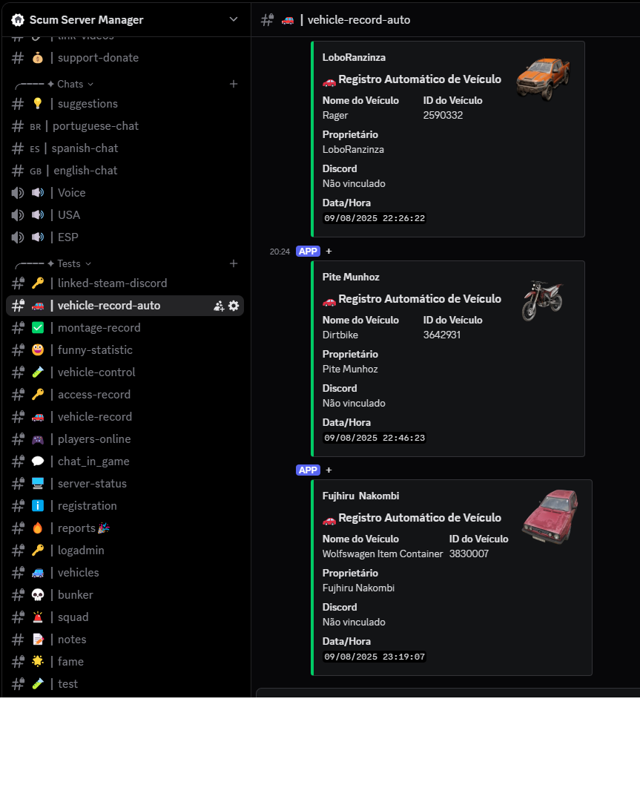
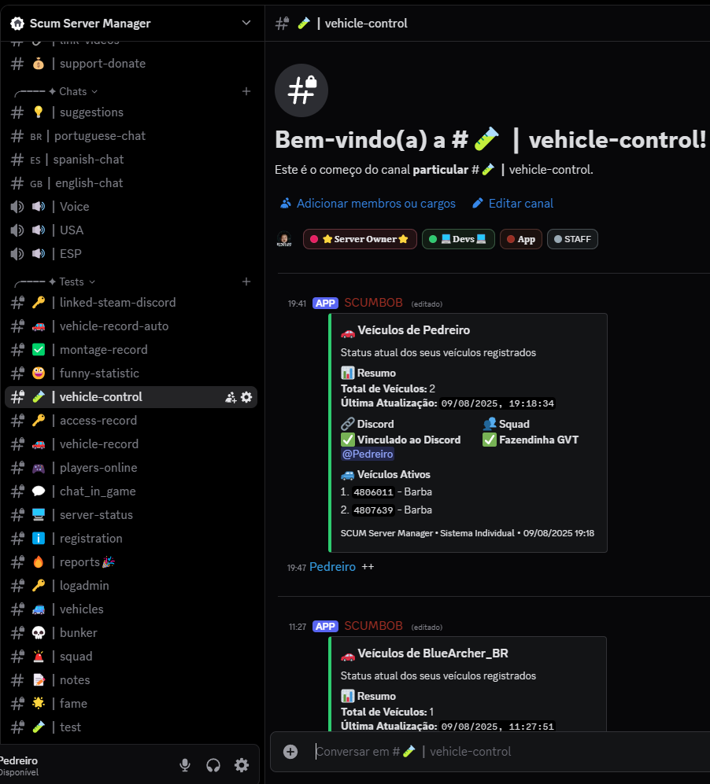
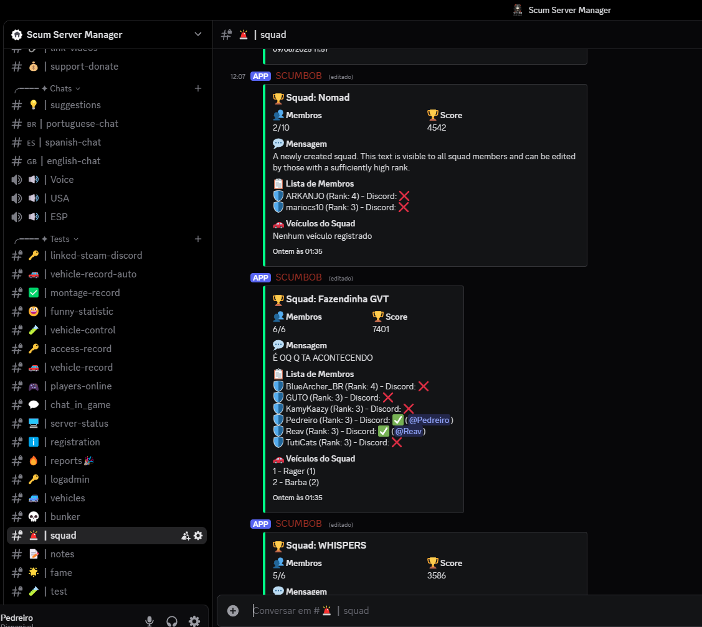
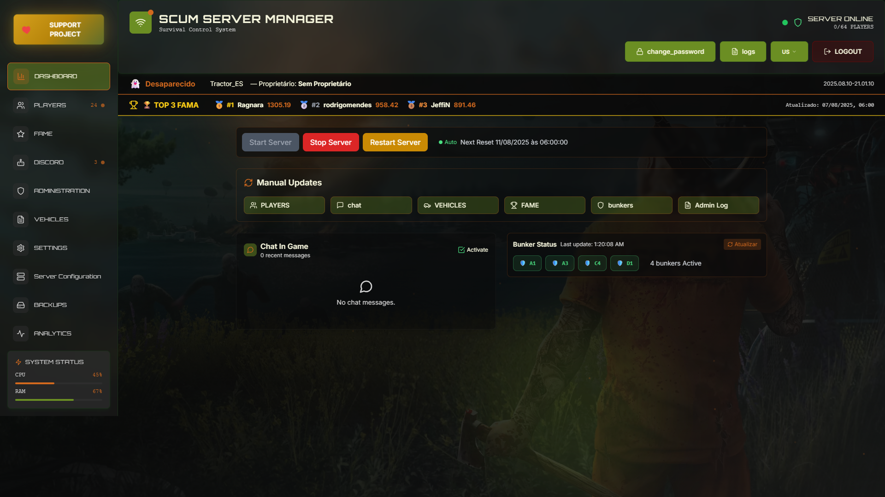

# 🚀 SCUM Server Manager 2.0

**Sistema completo de gerenciamento para servidores SCUM com interface web moderna, bot Discord integrado e controle avançado de veículos.**

## 📋 O que é o SCUM Server Manager 2.0?

O SCUM Server Manager 2.0 é uma ferramenta desenvolvida especificamente para administradores de servidores SCUM que precisam de controle total sobre seu servidor. Diferente de outras ferramentas, este sistema oferece:

### 🎯 **Funcionalidades Principais:**

#### **1. Dashboard em Tempo Real**
- Monitoramento de jogadores online/offline
- Estatísticas do servidor (CPU, RAM, status)
- Top 3 jogadores por fama
- Controle de reinicializações automáticas
- Status de bunkers ativos

#### **2. Sistema de Players Avançado**
- Gerenciamento completo de jogadores (24+ jogadores)
- Sistema de tags (Iniciante, VIP, Admin)
- Controle de whitelist, ban e mute
- Histórico de login e tempo de jogo
- Configuração de permissões de administrador

#### **3. Sistema de Fame (Reputação)**
- Ranking automático baseado em pontos de fama
- Top 8 jogadores com pontuações detalhadas
- Sistema de porcentagem relativa ao líder
- Atualizações automáticas de pontuação

#### **4. Bot Discord Integrado**
- **Comandos automáticos**: `/rg` para registro de veículos
- **Webhooks configuráveis** para 8 tipos de notificações:
  - Painel de Players
  - Admin Log
  - Bunkers
  - Status do Servidor
  - Veículos
  - Chat in Game
  - Sistema de Fama
  - Estatísticas Divertidas

#### **5. Controle de Veículos**
- **Sistema de registro automático** de veículos
- **Histórico completo** de eventos (desaparecimento, timer inativo)
- **Controle de propriedade** (com/sem proprietário)
- **Monitoramento de localização** (coordenadas X, Y, Z)
- **Sistema de denúncias** via Discord

#### **6. Painel de Administração**
- Logs detalhados de comandos administrativos
- Sistema de backup automático
- Configurações avançadas do servidor
- Monitoramento de recursos do sistema

#### **7. Configurações do Servidor**
- **General Settings**: Configurações básicas
- **World Settings**: NPCs, animais e ambiente
- **Vehicle Settings**: Veículos e combustível
- **Damage Settings**: Multiplicadores de dano
- **Respawn Settings**: Preços e tempos de respawn
- **Special Resources**: Recursos especiais do servidor

## 🖼️ Screenshots

### Dashboard Principal


### Sistema de Players


### Sistema de Fame


### Configurações Discord


### Administração


### Histórico de Veículos


### Configurações do Sistema


### Configuração do Servidor


## 🛠️ Tecnologias e Arquitetura

### **Backend (Node.js)**
- **Express.js**: API REST para comunicação com frontend
- **Discord.js**: Bot Discord com comandos automáticos
- **SQLite**: Banco de dados local para persistência
- **JWT**: Sistema de autenticação seguro
- **File System**: Monitoramento de logs do SCUM em tempo real

### **Frontend (React + TypeScript)**
- **React 18**: Interface moderna e responsiva
- **TypeScript**: Tipagem estática para maior segurança
- **Tailwind CSS**: Design system consistente
- **Framer Motion**: Animações suaves
- **PWA**: Funcionalidade offline e instalação mobile

### **Integração SCUM**
- **Monitoramento de logs**: Leitura automática dos arquivos de log do SCUM
- **Webhooks**: Notificações em tempo real para Discord
- **Controle de veículos**: Sistema de registro e monitoramento
- **Sistema de fama**: Integração com estatísticas do jogo

## 📁 Estrutura do Projeto

```
ScumServerManager2.0/
├── Backend/                    # Servidor Node.js
│   ├── routes/                # APIs REST
│   │   ├── players.js         # Gerenciamento de jogadores
│   │   ├── vehicles.js        # Controle de veículos
│   │   ├── famepoints.js      # Sistema de fama
│   │   ├── discord.js         # Integração Discord
│   │   └── server.js          # Status do servidor
│   ├── src/
│   │   ├── bot.js             # Bot Discord principal
│   │   ├── vehicle_control.js # Sistema de controle de veículos
│   │   ├── data/              # Dados e imagens do jogo
│   │   └── middleware/        # Autenticação e validações
│   └── server.js              # Servidor principal
├── Frontend/                   # Interface React
│   ├── src/
│   │   ├── components/        # Componentes reutilizáveis
│   │   ├── pages/             # Páginas da aplicação
│   │   └── services/          # Comunicação com API
│   └── public/                # Assets públicos
└── docs/                      # Documentação e screenshots
```

## 🚀 Instalação e Configuração

### **Pré-requisitos**
- Node.js 18+ instalado
- Servidor SCUM configurado e funcionando
- Bot Discord criado (opcional, mas recomendado)

### **1. Configuração do Backend**
```bash
cd Backend
npm install
cp env.example .env
```

**Configure o arquivo `.env`:**
```env
# Configurações do Servidor SCUM
SCUM_LOG_PATH=C:\SCUM\SCUM\Saved\Logs\SCUM.log
SCUM_ADMIN_LOG_PATH=C:\SCUM\SCUM\Saved\Logs\AdminLog.txt

# Configurações do Bot Discord
DISCORD_TOKEN=seu_token_do_bot
DISCORD_CLIENT_ID=seu_client_id

# Configurações do Servidor Web
PORT=3001
JWT_SECRET=sua_chave_secreta
```

### **2. Configuração do Frontend**
```bash
cd Frontend
npm install
npm run dev
```

### **3. Configuração do Bot Discord**
1. Crie um bot no [Discord Developer Portal](https://discord.com/developers/applications)
2. Configure as permissões necessárias
3. Adicione o token no arquivo `.env`
4. Configure os webhooks para cada tipo de notificação

## ⚙️ Funcionalidades Específicas

### **Sistema de Veículos**
- **Registro automático**: Veículos são registrados automaticamente quando aparecem no servidor
- **Controle de propriedade**: Sistema para vincular veículos a jogadores
- **Monitoramento**: Acompanhamento de localização e status
- **Comandos Discord**: `/rg` para registro manual de veículos

### **Sistema de Fame**
- **Pontuação automática**: Baseada nas ações dos jogadores no servidor
- **Ranking dinâmico**: Atualização em tempo real
- **Estatísticas detalhadas**: Porcentagem, histórico de mudanças

### **Integração Discord**
- **8 webhooks configuráveis** para diferentes tipos de notificação
- **Comandos automáticos** para administração
- **Notificações em tempo real** de eventos importantes

## 📚 Documentação Detalhada

- **[Configuração Completa](Docs/README.md)**: Guia passo a passo
- **[API Endpoints](Docs/Endpoints/)**: Documentação da API
- **[Sistema de Autenticação](Docs/RESUMO_SISTEMA_AUTH.md)**: Como funciona a segurança
- **[Controle de Veículos](Docs/RESUMO_VEHICLE_CONTROL.md)**: Sistema de veículos detalhado
- **[Bot Discord](Docs/RESUMO_FINAL_BOT.md)**: Configuração do bot

## 🎮 Compatibilidade

- **SCUM**: Versão 1.0.1.3.96391 (testado)
- **Sistemas**: Windows 10/11
- **Node.js**: 18.x ou superior
- **Discord**: Bot API v10

## 🤝 Contribuição

1. Faça um Fork do projeto
2. Crie uma Branch para sua Feature (`git checkout -b feature/NovaFuncionalidade`)
3. Commit suas mudanças (`git commit -m 'Adiciona nova funcionalidade'`)
4. Push para a Branch (`git push origin feature/NovaFuncionalidade`)
5. Abra um Pull Request

## 📄 Licença

Este projeto está sob a licença MIT. Veja o arquivo [LICENSE](LICENSE) para mais detalhes.

## 👨‍💻 Autor

**Paulo Pedreiro**
- GitHub: [@PauloPedreiro](https://github.com/PauloPedreiro)
- Projeto desenvolvido especificamente para a comunidade SCUM

## 🙏 Agradecimentos

- Comunidade SCUM Brasil
- Desenvolvedores das bibliotecas utilizadas
- Testadores e contribuidores do projeto

---

⭐ **Se este projeto te ajudou a gerenciar seu servidor SCUM, considere dar uma estrela no repositório!**

## 📞 Suporte

Para dúvidas, sugestões ou problemas:
- Abra uma [Issue](https://github.com/PauloPedreiro/Scum-Server-Manager/issues) no GitHub
- Consulte a documentação na pasta `Docs/`
